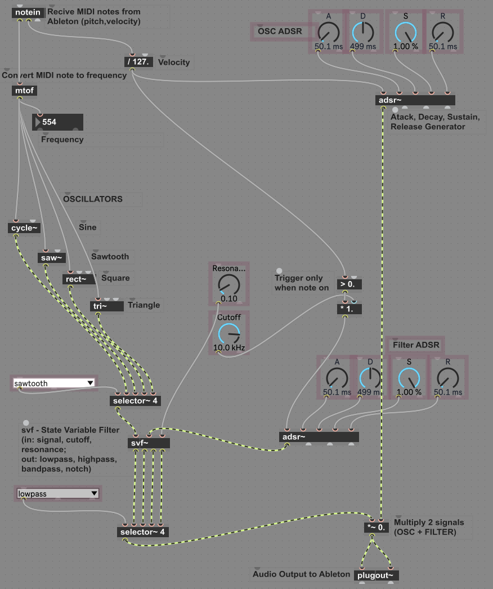

# Ableton MaxForLive - practice repository 

## MonoSynth.amxd 
*Monophonic Synth, with Oscilators: Sine, Saw, Square, Triangle, and filters: lowpass, hipass, bandpass, notch.*

Final Device: 

Wiring in details:

## PitchBend.amxd
*Allows to Pitch Bend outside MIDI clip - it could be automated*

